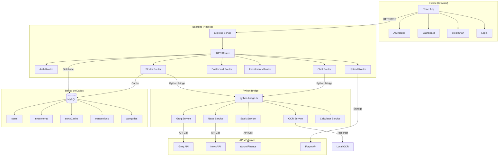
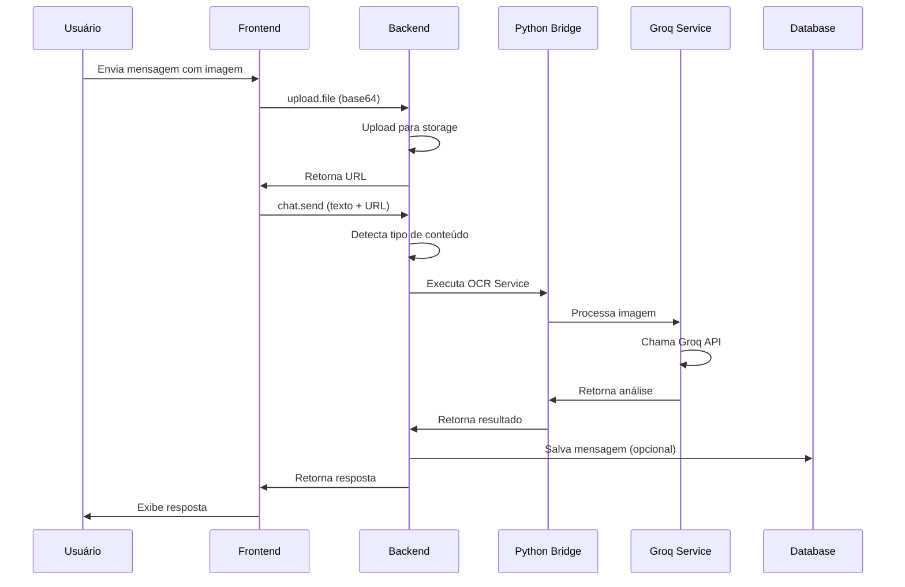
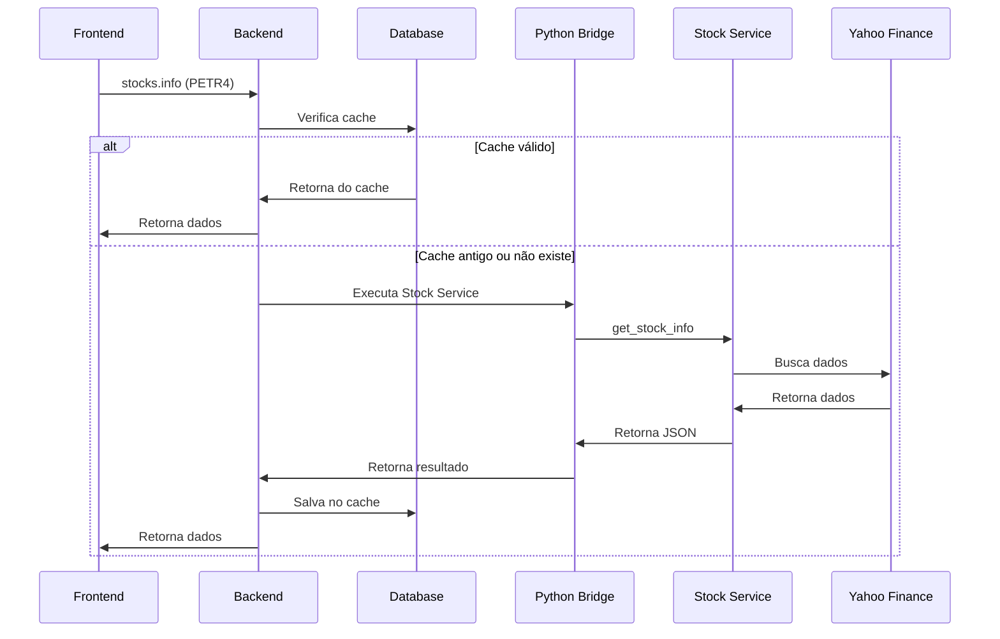
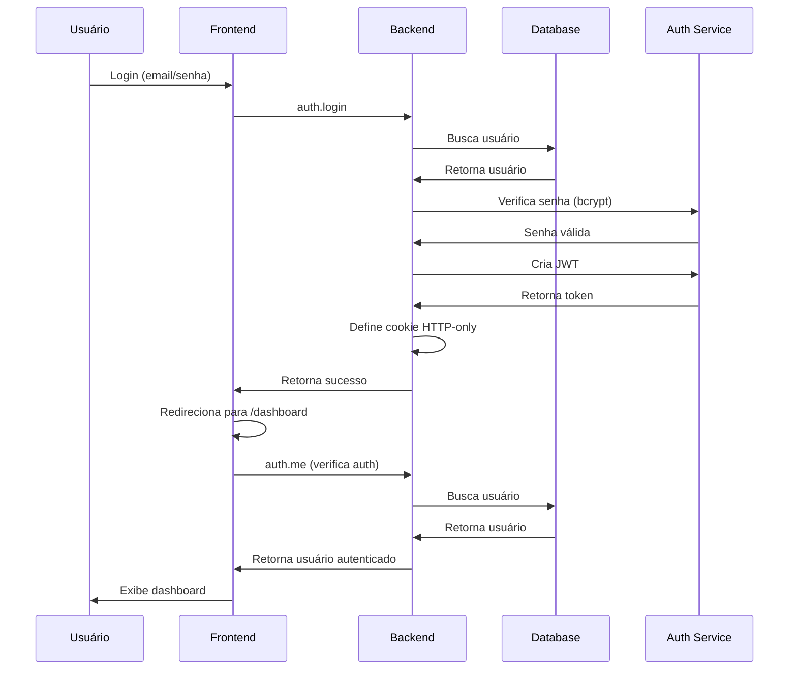

# 📊 Diagrama de Arquitetura do Bolsinho

Este documento contém diagramas visuais da arquitetura do Bolsinho.

## 🎨 Diagrama de Arquitetura Geral

### Diagrama em Mermaid



### Diagrama de Fluxo de Chat



### Diagrama de Fluxo de Ações



### Diagrama de Autenticação



## 🏗️ Estrutura de Componentes

### Frontend

```
client/src/
├── App.tsx                 # Componente raiz
├── main.tsx                # Entry point
├── pages/
│   ├── Dashboard.tsx       # Dashboard principal
│   ├── Login.tsx           # Página de login
│   └── Home.tsx            # Página inicial (deprecated)
├── components/
│   ├── AIChatBox.tsx       # Interface de chat
│   ├── StockChart.tsx      # Gráficos de ações
│   ├── StockCard.tsx       # Cards de ações
│   ├── StockGrid.tsx       # Grid de ações
│   └── ui/                 # Componentes shadcn/ui
├── lib/
│   ├── trpc.ts             # Cliente tRPC
│   └── utils.ts            # Utilitários
└── contexts/
    └── ThemeContext.tsx    # Context de tema
```

### Backend

```
server/
├── _core/
│   ├── index.ts            # Servidor Express
│   ├── trpc.ts             # Configuração tRPC
│   ├── context.ts          # Context do tRPC
│   ├── auth.ts             # Autenticação
│   ├── llm.ts              # Integração LLM
│   ├── cookies.ts          # Gerenciamento de cookies
│   └── ...
├── routers.ts              # Rotas tRPC
├── db.ts                   # Funções de banco
├── python-bridge.ts        # Bridge para Python
└── services/               # Serviços Python
    ├── groq_service.py     # Serviço Groq
    ├── groq_cli.py         # CLI Groq
    ├── ocr_service.py      # Serviço OCR
    ├── ocr_cli.py          # CLI OCR
    ├── news_service.py     # Serviço News
    ├── news_cli.py         # CLI News
    ├── stock_service.py    # Serviço Stock
    ├── stock_cli.py        # CLI Stock
    ├── calculator_service.py # Serviço Calculator
    └── calculator_cli.py   # CLI Calculator
```

### Banco de Dados

```
drizzle/
├── schema.ts               # Schema do banco
├── relations.ts            # Relações
└── migrations/             # Migrações
    ├── 0000_*.sql
    ├── 0001_*.sql
    └── 0002_*.sql
```

## 🔄 Fluxo de Requisições

### 1. Requisição de Chat

```
Frontend → tRPC → Backend → Python Bridge → Groq Service → Groq API
                                                              ↓
Frontend ← tRPC ← Backend ← Python Bridge ← Groq Service ← Resposta
```

### 2. Requisição de Ações

```
Frontend → tRPC → Backend → Database (Cache)
                              ↓ (se cache inválido)
                          Python Bridge → Stock Service → Yahoo Finance
                                                              ↓
Frontend ← tRPC ← Backend ← Database (Cache) ← Python Bridge ← Resposta
```

### 3. Upload de Arquivo

```
Frontend → tRPC → Backend → Storage (Forge API ou Data URL)
                              ↓
Frontend ← tRPC ← Backend ← URL do arquivo
```

## 📦 Dependências Principais

### Frontend
- `react` - Framework UI
- `@trpc/react-query` - Cliente tRPC
- `@tanstack/react-query` - Cache e estado
- `wouter` - Roteamento
- `recharts` - Gráficos
- `tailwindcss` - Estilização
- `shadcn/ui` - Componentes

### Backend
- `express` - Framework web
- `@trpc/server` - Servidor tRPC
- `drizzle-orm` - ORM
- `mysql2` - Cliente MySQL
- `bcryptjs` - Hash de senhas
- `jsonwebtoken` - JWT
- `zod` - Validação

### Python
- `groq` - Cliente Groq API
- `yfinance` - Dados de ações
- `pytesseract` - OCR
- `PyPDF2` - Processamento de PDFs
- `pdf2image` - Conversão de PDFs
- `pandas` - Manipulação de dados
- `newsapi-python` - Cliente NewsAPI
- `decimal` - Cálculos precisos

## 🔐 Segurança

### Camadas de Segurança

1. **Frontend**
   - Validação de entrada
   - Sanitização de dados
   - HTTPS obrigatório

2. **Backend**
   - Autenticação JWT
   - Autorização por role
   - Validação com Zod
   - Rate limiting

3. **Banco de Dados**
   - Prepared statements (Drizzle ORM)
   - Senhas hasheadas (bcrypt)
   - Cookies HTTP-only

4. **Python Bridge**
   - Validação de entrada
   - Timeout de requisições
   - Tratamento de erros

## 🚀 Performance

### Otimizações

1. **Cache de Ações**
   - Dados em cache no banco
   - Reduz chamadas à API
   - Melhora tempo de resposta

2. **Rate Limiting**
   - Delays entre requisições
   - Evita bloqueios
   - Retry automático

3. **Lazy Loading**
   - Banco inicializado sob demanda
   - Serviços executados quando necessário

4. **Type Safety**
   - tRPC garante type-safety
   - Reduz erros em runtime
   - Melhora performance de desenvolvimento

## 📊 Métricas e Monitoramento

### Métricas Importantes

1. **Performance**
   - Tempo de resposta da API
   - Tempo de processamento Python
   - Tempo de consulta ao banco

2. **Uso**
   - Número de requisições
   - Taxa de cache hit
   - Taxa de erro

3. **Recursos**
   - Uso de CPU
   - Uso de memória
   - Uso de disco

## 🔗 Links Relacionados

- [Documentação da Arquitetura](ARQUITETURA.md)
- [Documentação da API](API.md)
- [Guia de Setup](setup/INICIO_RAPIDO.md)
- [README Principal](../README.md)

